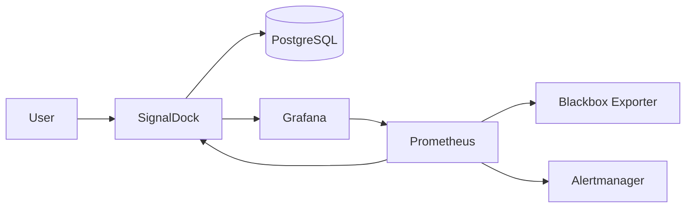
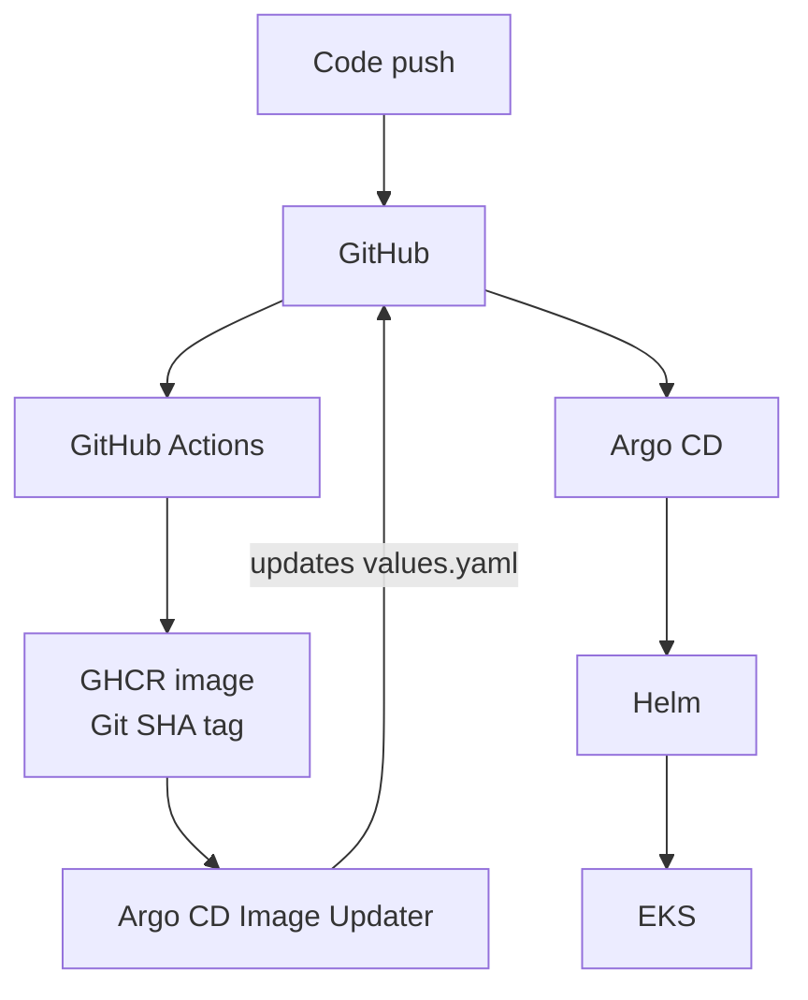
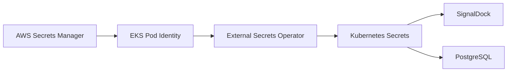

# SignalDock

SignalDock is a self-hosted endpoint monitoring application built with Go.

It combines endpoint management, HTTP/TLS probing, metrics, dashboards, alerting, persistent storage, and a GitOps-based Kubernetes deployment in a single project. The V1 deployment model is intentionally **private by default**: each user or team runs its own instance rather than exposing the monitoring stack as a public SaaS.

## What it includes

- Endpoint management and on-demand HTTP/TLS checks
- PostgreSQL persistence
- Prometheus metrics and alert rules
- Blackbox Exporter probing
- Grafana dashboards embedded through SignalDock
- Alertmanager
- Docker Compose for local use
- Kubernetes + Helm deployment
- Argo CD App of Apps and automated GitOps reconciliation
- GitHub Actions CI and GHCR image publishing
- Argo CD Image Updater Git write-back
- Terraform-managed AWS infrastructure with EKS
- AWS Secrets Manager + External Secrets Operator + EKS Pod Identity
- EBS-backed persistent volumes on AWS
- Kubernetes workload resource limits and security hardening

## Architecture

### Application and observability



Only SignalDock is intended to be accessed directly. PostgreSQL and the observability services remain internal to the deployment.

### AWS GitOps delivery



The image pipeline only publishes a new SignalDock image when image-affecting files change. Image Updater writes the selected Git SHA back to the Helm values file, making Git the deployment source of truth.

### AWS secrets flow



Secret **containers and permissions** are managed with Terraform. Secret **values** are deliberately kept out of Git and Terraform state.

## Local quick start

### Requirements

- Go 1.27+
- Docker
- Docker Compose

Copy the example environment file:

```bash
cp .env.example .env
```

`.env` is used only by Docker Compose and is ignored by Git; `.env.example` is the tracked template. Kubernetes/Helm and AWS deployments do not consume this file.

Replace the example passwords in `.env`, then start the stack:

```bash
make up
```

Open:

```text
http://localhost:8080
```

Check the Compose services:

```bash
make status
```

Check application health:

```bash
curl -f http://localhost:8080/healthz
```

Stop the stack:

```bash
make down
```

PostgreSQL, Prometheus, and Grafana data use persistent Docker volumes. To also remove local data:

```bash
docker compose down -v
```

## Development

The Makefile provides the main development workflow:

```bash
make build
make run
make test
make check
make ci
```

`make test` starts an isolated PostgreSQL test container and runs the Go test suite with the race detector.

Build the application image locally with:

```bash
make docker-build
```

Validate the Helm chart locally with:

```bash
make helm-lint
```

## Kubernetes and AWS

SignalDock uses one Helm chart for Kubernetes workloads. Shared Prometheus, Grafana, Blackbox, and Alertmanager configuration lives under:

```text
deploy/helm/signaldock/files/
```

The same configuration files are consumed by Docker Compose, avoiding separate configuration sources for local and Kubernetes deployments.

For a direct local Helm deployment, the Makefile exposes:

```bash
make helm-up
make helm-status
make helm-down
```

The required `signaldock` and `postgres` Kubernetes Secrets must already exist when installing the chart directly. The GitOps-based local deployment instead obtains them through External Secrets.

The AWS environment is provisioned with Terraform and includes:

- VPC and public subnets across two Availability Zones
- EKS cluster and managed node group
- EKS Pod Identity Agent
- EBS CSI driver
- IAM roles and least-scope policies for cluster workloads
- AWS Secrets Manager secret containers

Kubernetes resources are then reconciled through Argo CD using an App of Apps layout.

The supported AWS workflow is:

```bash
make aws-up

# Populate the AWS Secrets Manager values created by Terraform.

make aws-bootstrap
make aws-status
```

`make aws-up` creates the Secrets Manager containers only. Populate `signaldock/lab/signaldock` and `signaldock/lab/postgres` in AWS Secrets Manager using the required key/value fields documented in [`deploy/README.md`](deploy/README.md). Do not put these AWS secret values in `.env`, Git, or Terraform state.

When the lab is no longer needed:

```bash
make aws-destroy
```

`aws-destroy` stops GitOps reconciliation, removes the SignalDock workloads and PVCs, waits for their dynamically provisioned EBS volumes to disappear, and only then runs `terraform destroy`.

The default AWS profile, region, cluster, and kubectl context can be overridden from the command line without editing the repository, for example:

```bash
make aws-up AWS_PROFILE=my-profile AWS_REGION=eu-west-1
```

See [`deploy/README.md`](deploy/README.md) for ownership boundaries, the complete AWS bootstrap and teardown flow, local GitOps notes, and verification commands.

### Private AWS access

V1 does not expose SignalDock or its observability stack publicly. Access an AWS deployment through Kubernetes port forwarding:

```bash
kubectl port-forward svc/signaldock -n signaldock 8080:8080
```

Then open:

```text
http://localhost:8080
```

Public ingress, domains, TLS termination, and multi-tenant SaaS operation are intentionally outside the V1 scope.

## GitOps layout

```text
deploy/argocd/
├── bootstrap/
│   ├── aws-root-application.yaml
│   └── local-root-application.yaml
├── aws/
│   ├── aws-platform-application.yaml
│   ├── external-secrets-aws-application.yaml
│   ├── signaldock-aws-application.yaml
│   └── signaldock-image-updater-aws.yaml
└── local/
    ├── external-secrets-application.yaml
    └── signaldock-application.yaml
```

Only the root Application is bootstrapped explicitly. Child Applications are subsequently reconciled from Git with automated prune and self-heal.

AWS is the single Image Updater write-back owner. Local clusters consume the resulting Git changes but do not compete to update `values.yaml`.

## CI/CD

GitHub Actions validates four layers independently:

- **Go** — formatting, vetting, tests, race detection, and build
- **Docker** — image build
- **Helm/Kubernetes** — chart linting, rendering, and server-side dry-run validation
- **Terraform** — formatting, initialization, and configuration validation

On pushes to `main`, a GHCR image tagged with the full Git SHA is published only when application image inputs change. Argo CD Image Updater then commits the new SHA to Git, and Argo CD rolls the deployment forward automatically.

## Repository structure

```text
cmd/signaldock/                  Application entry point and startup lifecycle
internal/                        Application packages and tests
deploy/helm/signaldock/          Kubernetes Helm chart and shared service config
deploy/argocd/                   Local/AWS App of Apps GitOps definitions
deploy/external-secrets/         Local and AWS External Secrets resources
deploy/aws/                      AWS-specific Kubernetes platform resources
infra/terraform/                 AWS infrastructure and IAM
.github/workflows/ci.yml         CI/CD pipeline
compose.yaml                     Local full-stack deployment
compose.test.yaml                Isolated integration-test PostgreSQL
```

## V1 scope

SignalDock V1 is designed for a single private deployment operated by one user or team.

Deliberately out of scope for V1:

- public ALB / Ingress and custom domains
- multi-tenant SaaS operation
- multiple SignalDock replicas
- PostgreSQL high availability
- application autoscaling
- centralized log aggregation

Keeping these outside V1 allows the project to focus on a reproducible private monitoring stack and its delivery platform rather than adding infrastructure that the current use case does not require.

## License

SignalDock is licensed under the [MIT License](LICENSE).
